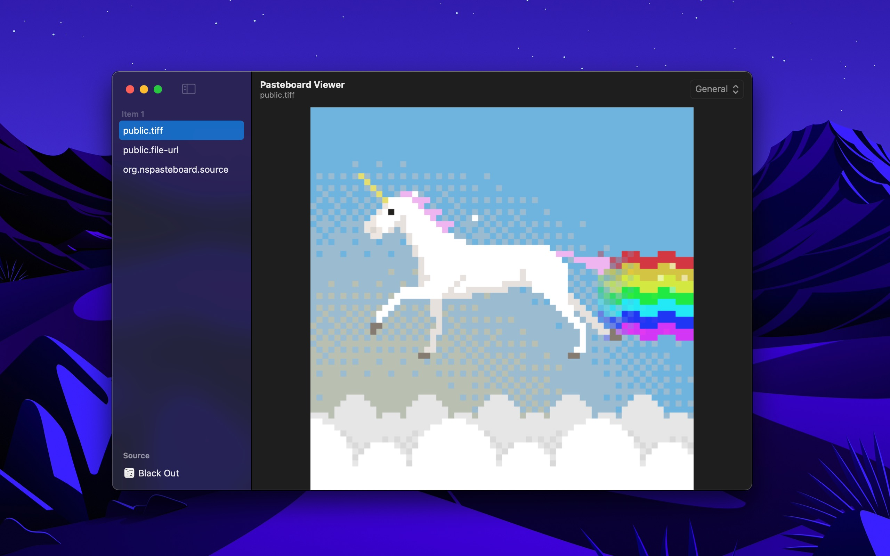

	
	<h1>Pasteboard Viewer</h1>
	

		<b>Inspect the system pasteboards</b>
	

	 
	 
	 

This is a developer utility that lets you inspect the various system pasteboards. This can be useful to ensure your app is putting the correct data on [NSPasteboard](https://developer.apple.com/documentation/appkit/nspasteboard). The app refreshes the pasteboard contents live and can preview text, RTF, and images.

Note that this is not a clipboard manager. If you're not a Mac developer, you probably don't want this app.

You can make the window always stay in front by enabling “Stay in Front” in the “Window” menu.

Use the up/down arrow keys to switch between the pasteboard items.

It hides obsolete system pasteboard types that have modern equivalents. This includes `CorePasteboardFlavorType`, `NSStringPboardType`, `NSFilenamesPboardType`, etc.

## Download

Requires macOS 10.15 or later.

## Screenshot

## FAQ

#### What's with the genie lamp?

It's a reference to the icon of Apple's old NSPasteboard sample app called [Clipboard Viewer](https://developer.apple.com/library/archive/samplecode/ClipboardViewer/Introduction/Intro.html).

#### Can I contribute localizations?

I'm not interested in localizing the app.

#### Can you add support for macOS 10.14 or older?

This app uses SwiftUI, which only works on macOS 10.15 and later.

## Related

- [Website](https://sindresorhus.com/pasteboard-viewer)
- [Dato](https://sindresorhus.com/dato) - Better menu bar clock with calendar and time zones
- [Gifski](https://github.com/sindresorhus/Gifski) - Convert videos to high-quality GIFs
- [More apps…](https://sindresorhus.com/apps)
