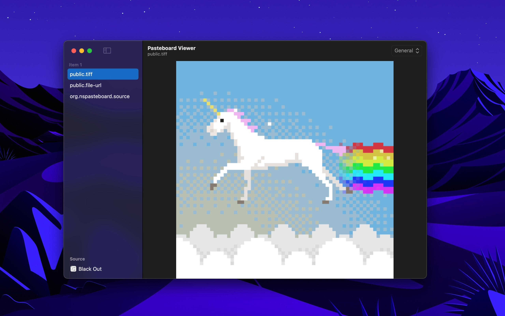
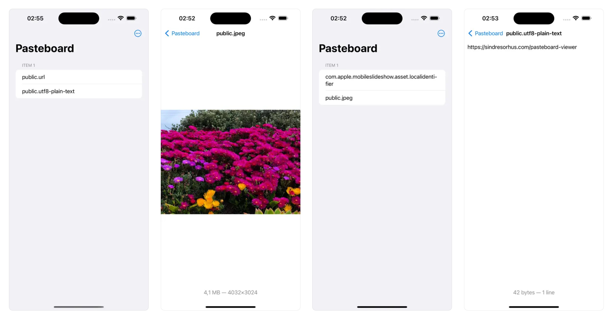

	 
	 
	
	<h1>Pasteboard Viewer</h1>
	

		<b>Inspect the system pasteboards</b>
	

	 
	 
	 

This is a developer utility that lets you inspect the various system pasteboards. This can be useful to ensure your app is putting the correct data on [NSPasteboard](https://developer.apple.com/documentation/appkit/nspasteboard) or [UIPasteboard](https://developer.apple.com/documentation/uikit/uipasteboard/). The app refreshes the pasteboard contents live and can preview text, RTF, images, and anything that has a Quick Look preview.

Note that this is not a clipboard manager. If you're not a programmer, you probably don't want this app.

On macOS, you can make the window always stay in front by enabling “Stay in Front” in the “Window” menu.

Use the up/down arrow keys to switch between the pasteboard items.

It hides obsolete system pasteboard types that have modern equivalents. This includes `CorePasteboardFlavorType`, `NSStringPboardType`, `NSFilenamesPboardType`, etc.

Tip: Right-click (macOS) or long-tap (non-macOS) an item in the sidebar to copy the type identifier.

## Download

*Requires minimum macOS 26, iOS 26, or visionOS 26*

**Older versions (macOS)**

- [2.11.0](https://github.com/sindresorhus/Pasteboard-Viewer/releases/download/v2.11.0/Pasteboard.Viewer.2.11.0.-.macOS.15.zip) for macOS 15+
- [2.8.0](https://github.com/sindresorhus/Pasteboard-Viewer/releases/download/v2.8.0/Pasteboard.Viewer.2.8.0.-.macOS.14.zip) for macOS 14+
- [2.5.1](https://github.com/sindresorhus/Pasteboard-Viewer/releases/download/v2.5.1/Pasteboard.Viewer.2.5.1.-.macOS.13.zip) for macOS 13+
- [2.4.1](https://github.com/sindresorhus/meta/files/13539167/Pasteboard-Viewer-2.4.1-macOS-12.zip) for macOS 12+
- [2.2.2](https://github.com/sindresorhus/Pasteboard-Viewer/releases/download/v2.2.2/Pasteboard.Viewer.2.2.2.-.macOS.11.zip) for macOS 11+
- [1.5.1](https://github.com/sindresorhus/Pasteboard-Viewer/releases/tag/v1.5.1) for macOS 10.15+

**Non-App Store version (macOS)**

A special version for users that cannot access the App Store. It won't receive automatic updates. I will update it here once a year.

[Download](https://www.dropbox.com/scl/fi/ofwrr7xwgkbh2gpyosdkl/Pasteboard-Viewer-2.12.0-1774843275.zip?rlkey=5xslv1f9me08bgwsn9yb2kpp8&raw=1) *(2.12.0 · macOS 26+)*

## Screenshot

## FAQ

#### Can I contribute localizations?

I don't plan to localize the app.

#### [More FAQs…](https://sindresorhus.com/apps/faq)

## Links

- [Website](https://sindresorhus.com/pasteboard-viewer)
- [More apps by me](https://sindresorhus.com/apps)
